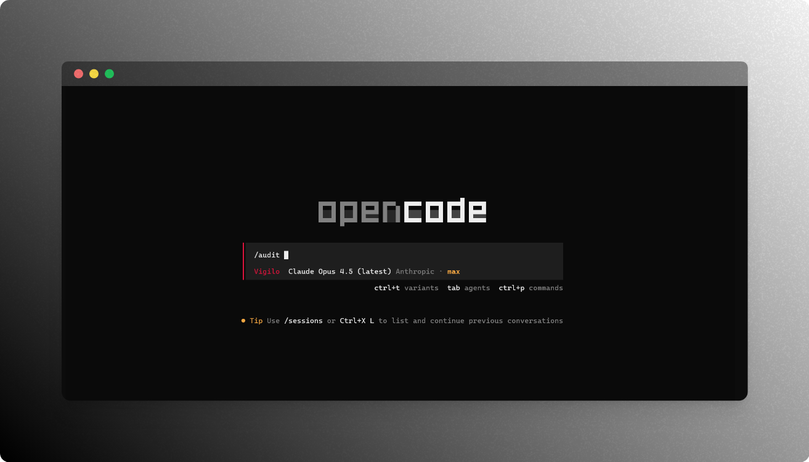

<p align="center">
  
</p>

<h1 align="center">Vigilo</h1>

<p align="center">
  <strong>Web3 Smart Contract Security Auditing Agent</strong>
</p>

<p align="center">
  From Latin <em>vigilo</em> — "I watch, I guard." An autonomous security legion inspired by the command structure of the Roman army, watching over your smart contracts to find vulnerabilities before attackers do.
</p>

<div align="center">

[](https://www.npmjs.com/package/vigilo)
[](https://github.com/PurpleAILAB/Vigilo/releases)
[](https://github.com/PurpleAILAB/Vigilo/stargazers)
[](https://github.com/PurpleAILAB/Vigilo/issues)
[](https://github.com/PurpleAILAB/Vigilo/blob/main/LICENSE)

</div>

---

## What is Vigilo?

Vigilo is an autonomous security legion for smart contract auditing, inspired by the command structure of the Roman army. It runs inside [OpenCode](https://github.com/anomalyco/opencode), deploying specialized agents in parallel to find vulnerabilities and generate validated PoCs.

### The Legion

| Agent | Latin Role | Mission |
|-------|-----------|---------|
| **Vigilo** | Commander (*Imperator*) | Orchestrates the full audit pipeline |
| **Quaestor** | Investigator (*Quaestor*) | Pre-audit interview & scope planning |
| **Explorator** | Scout (*Exploratores*) | Code reconnaissance — maps structure and flows |
| **Speculator** | Intelligence (*Speculatores*) | Documentation intel — extracts design and invariants |
| **Centuriones** | Officers (*Centuriones*) | 8 specialist auditors deployed by protocol type |

<p align="center">
  
</p>

---

## Installation

### OpenCode

### For LLM Agents (Recommended)

Paste this into your LLM agent session:

```
Install and configure vigilo by following the instructions here:
https://raw.githubusercontent.com/PurpleAILAB/Vigilo/main/packages/opencode/docs/installation.md
```

### Manual Install

```bash
bunx vigilo install
```

### Claude Code

```bash
/plugin marketplace add PurpleAILAB/Vigilo
/plugin install vigilo@Vigilo
```

---

See the full [Installation Guide](./packages/opencode/docs/installation.md) for more options.

### Uninstallation

1. Remove the plugin from your OpenCode config:

```bash
# Edit ~/.config/opencode/opencode.json and remove "vigilo" from the plugin array
```

2. Remove configuration files:

```bash
rm -f ~/.config/opencode/vigilo.json
```

3. Verify removal:

```bash
opencode --version
```

---

## Features

- **Automated Audit Workflow**: Scope → Recon (*Exploratores*) → Deep Analysis (*Centuriones*) → PoC → Report
- **Specialized Auditors**: Reentrancy, Oracle, Access Control, Flashloan, Logic, DeFi, Token, Cross-Chain
- **Multi-Language Support**: Solidity, Vyper, Cairo, Rust
- **Foundry Integration**: `forge build`, `forge test`, `forge coverage`
- **LSP Integration**: Goto-definition, references, diagnostics
- **Parallel Analysis**: Multiple auditors running concurrently
- **PoC Validation**: Auto-generate and validate Foundry tests

---

## Usage

```bash
cd my-solidity-project
opencode

# Start audit
/audit

# Generate PoC
/poc .vigilo/findings/high/H-01-reentrancy.md
```

---

## Directory Structure

```
.vigilo/
├── recon/           # Explorator & Speculator outputs
├── findings/        # Vulnerability findings
│   ├── high/
│   └── medium/
├── poc/             # PoC validation logs
└── reports/         # Final reports
```

---

## Platforms

| Platform | Package | Status |
|----------|---------|--------|
| [OpenCode](https://github.com/anomalyco/opencode) | [`packages/opencode`](./packages/opencode) | ⭐ **Recommended** |
| [Claude Code](https://claude.ai/code) | [`packages/claude`](./packages/claude) | Stable |

> **Why OpenCode?** More flexibility with model selection, better plugin extensibility, and cost-effective auditing with configurable models per auditor.

---

## Benchmarking

Measure Vigilo's audit accuracy against verified security reports from Code4rena, Sherlock, and Cantina.

```bash
# Run full benchmark pipeline
bunx vigilo-bench sherlock_cork-protocol_2025_01 -w -v
```

**Pipeline:** checkout → audit → score → report

See [`packages/bench`](./packages/bench) for full documentation.

---

## Troubleshooting

```bash
bunx vigilo doctor
bunx vigilo doctor --verbose
```

| Issue | Solution |
|-------|----------|
| OpenCode not found | Install from https://github.com/anomalyco/opencode |
| Foundry not found | `curl -L https://foundry.paradigm.xyz \| bash && foundryup` |
| Vigilo not registered | Run `bunx vigilo install` again |

---

## Development

For contributors working on Vigilo itself.

### Setup

```bash
git clone https://github.com/PurpleAILAB/Vigilo.git
cd vigilo/packages/opencode
bun install
bun link
```

### Development Mode

1. **Configure local plugin path** in `~/.config/opencode/opencode.json`:

```json
{
  "plugin": [
    "D:/path/to/vigilo/packages/opencode"
  ]
}
```

2. **Run watch mode**:

```bash
bun run dev
```

3. **Restart OpenCode** to load changes.

### Quick Commands

| Task | Command |
|------|---------|
| Build | `bun run build` |
| Watch mode | `bun run dev` |
| Test CLI | `bun src/cli/index.ts install` |
| Run doctor | `bun src/cli/index.ts doctor --verbose` |

### Restore Production Mode

```bash
bunx vigilo install
```

This resets the plugin path to `vigilo@latest`.

---

## License

[Business Source License 1.1](LICENSE)

- **Non-production use**: Free
- **Production use**: Requires commercial license
- **Change Date**: 2029-01-21 (converts to Apache-2.0)

Commercial licensing: catower917@gmail.com

---

<div align="center">

**Ready to hunt bugs? 🔍**

[Get Started](./packages/opencode/docs/installation.md) · [Report Bug](https://github.com/PurpleAILAB/Vigilo/issues) · [Request Feature](https://github.com/PurpleAILAB/Vigilo/issues)

</div>
