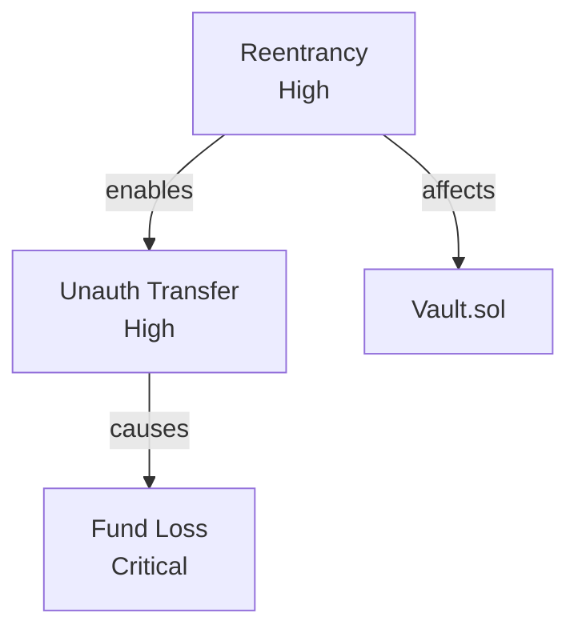

# Attack-Chain Reasoning & the `.vigilo/` Workspace

Vigilo persists everything it learns about a target as **plain files on disk**, under a
`.vigilo/` directory in the audit workspace. There is no database. Recon notes,
findings, PoC logs, and reports are all Markdown (and Solidity, for PoC tests), so the
entire audit state is human-readable, diff-able, and committable.

On top of those file artifacts, the `graph-builder` agent applies a **conceptual graph
model** — it reasons about how contracts call each other and how individual findings
chain into multi-step exploits, and writes that reasoning back out as Markdown summaries
and diagram files. The "graph" is an analysis lens, not a running graph engine.

> **Where a flat findings list captures *what* is wrong, attack-chain reasoning captures
> *how* — how an attacker reaches a vulnerable function, and how individual findings
> compose into an end-to-end exploit.**

---

## What's on Disk: the `.vigilo/` Layout

Everything Vigilo produces lives under `.vigilo/`. The key locations:

```
.vigilo/
├── scope.md                 # Resolved audit scope
├── notepad/                 # Cumulative, shared audit intelligence (Markdown)
│   ├── trust-assumptions.md
│   ├── external-deps.md     # Oracles, bridges, tokens, external contracts
│   ├── cross-contract-flows.md
│   ├── risk-priorities.md
│   ├── confirmed-findings.md
│   ├── rejected-hypotheses.md
│   └── issues.md
├── recon/
│   ├── code-findings.md
│   └── docs-findings.md
├── findings/                # VERIFIED findings (PoC passed), by severity/auditor
│   ├── high/   { reentrancy, oracle, access-control, ... }
│   ├── medium/ { ... }
│   └── low/    { ... }
├── unverified/              # THEORETICAL findings (PoC failed/impossible)
├── poc/                     # PoC validation logs ({severity}-{id}-{title}.md)
├── graph/                   # graph-builder outputs (see below)
└── reports/                 # Submission-ready reports
```

The executable PoC tests themselves live in `test/poc/` in the project root (so Foundry
can run them), while their validation logs are recorded under `.vigilo/poc/`.

This file-based design is what lets the stateless auditors share context: the
**notepad** is the shared memory, written by recon and appended to by each auditor.

---

## The Conceptual Graph Model

When the `graph-builder` agent maps attack chains, it thinks in terms of nodes and
relationships. This vocabulary is a **reasoning aid** the agent uses while reading the
file artifacts above — it is not a schema in any database.

### Node concepts

| Node | Represents |
|------|------------|
| **Contract** | A deployed or source contract |
| **Function** | A function or modifier |
| **Vulnerability** | A class of weakness (root cause) |
| **Finding** | A concrete instance reported by an auditor |
| **Attacker** | An adversarial role / capability |
| **Admin** | A privileged role |
| **Asset** | Tokens, collateral, or value at risk |
| **Oracle** | A price or data feed |
| **Bridge** | A cross-chain messaging endpoint |
| **External** | An external contract or call target |
| **Pattern** | A known-safe or known-bad code pattern |

### Relationship concepts

Relationships are directional and encode call structure, data flow, control, and exploit
logic.

| Relationship | Meaning | Typical direction |
|--------------|---------|-------------------|
| `CALLS` | Function invokes another function | `Function → Function` |
| `READS` / `WRITES` | Reads / mutates a storage variable | `Function → State` |
| `CONTROLS` | Role governs a function or state | `Admin → Function` |
| `TRANSFERS` | Moves an asset | `Function → Asset` |
| `EXPLOITS` | Attacker leverages a vulnerability | `Attacker → Vulnerability` |
| `CAUSES` | One condition produces another | `Vulnerability → Finding` |
| `REQUIRES` | A precondition for a step | `Finding → State` |
| `ENABLES` | One step unlocks the next | `Finding → Finding` |
| `CHECKS` | A guard validates a condition | `Function → State` |
| `USES_ORACLE` | Function depends on a price feed | `Function → Oracle` |
| `AFFECTS` | A finding impacts a node | `Finding → Asset` |

---

## Attack Chain Modeling

A single finding is one link. Vigilo composes findings into an **attack chain** by
connecting them with `REQUIRES`, `ENABLES`, and `CAUSES`. A chain starts from an
attacker capability and terminates at the value actually at risk:

```
(Attacker)
   │ EXPLOITS
   ▼
(Vulnerability: missing access control)
   │ CAUSES
   ▼
(Finding: H-01 unguarded setOracle)
   │ ENABLES
   ▼
(Finding: H-02 spot-price manipulation)
   │ ENABLES
   ▼
(Finding: H-03 underpriced liquidation)
   │ AFFECTS
   ▼
(Asset: collateral pool)
```

Each `ENABLES` edge encodes that the prior step is a precondition for the next, so the
path from attacker to asset is a complete, ordered exploit narrative — exactly what a PoC
must reproduce and what a report must explain.

---

## What `graph-builder` Actually Produces

The agent writes its attack-chain analysis back to disk as files under `.vigilo/graph/`:

- **Diagrams** — Mermaid (`.mmd`) and Graphviz DOT (`.dot`) renderings of attack chains,
  for embedding directly in Markdown reports.
- **Chain summaries** — Markdown describing how findings combine, which findings are
  pivot points, and the resulting compound impact.

A Mermaid chain looks like:



These Mermaid/DOT/Markdown files are human-readable static artifacts.

## Queryable Store + Tools

Alongside the static artifacts, Vigilo keeps a **queryable file-based store** at
`.vigilo/kg/` (JSONL: `nodes.jsonl`, `edges.jsonl`) exposed through three tools:

| Tool | Purpose |
|------|---------|
| `kg_record` | Add a node (`Contract`, `Function`, `Finding`, `Asset`, …) or edge (`CALLS`, `ENABLES`, `CAUSES`, `AFFECTS`, …). Nodes dedupe on `(type, key)`, edges on `(from, type, to)`; re-recording merges props. |
| `kg_query` | List nodes by type/property or edges by type/endpoint (e.g. "all High findings", "what `AFFECTS` Vault"). |
| `kg_chain` | Trace multi-step attack chains from a node through `ENABLES`/`CAUSES`/`REQUIRES` edges (cycle-safe). |

Every record carries **runtime-set provenance** (`auditor`, `session`, `recordedAt`) — never
taken from model-supplied props — so the graph stays a trustworthy audit trail. This is a
plain JSONL store, not a graph database; it needs no external service.

---

## Evidence Hierarchy

Every finding carries an evidence type that records *how strongly* it has been
substantiated, which in turn caps its allowable severity. This is enforced throughout the
audit pipeline (see [Architecture](./architecture.md)).

| Evidence Type | What It Means | Max Severity |
|---|---|---|
| `POC_VALIDATED` | `forge test` passes with assertions proving impact | Critical, High |
| `STATIC_CONFIRMED` | Code pattern matched + call path verified | High, Medium |
| `TRACE_CONFIRMED` | Reachability proven via LSP / manual trace | Medium |
| `THEORETICAL` | Logic argument only, no code proof | Low, Informational |

`VERIFIED` findings (with a passing PoC) are written to `.vigilo/findings/`;
`THEORETICAL` findings go to `.vigilo/unverified/`.

---

## Future / Optional: a Real Graph Database

The JSONL store above is intentionally backend-agnostic. A persistent property-graph
*database* (e.g. Neo4j) could be added later for cross-audit history and large-scale chain
detection across thousands of findings — **that is not implemented today.** Vigilo's current
source has no graph-database driver or dependency; persistence is the file-based `.vigilo/`
workspace (static artifacts + the queryable JSONL store) described above.

---

## See Also

- **[Architecture](./architecture.md)** — where attack-chain reasoning sits in the pipeline.
- **[Agents](./agents.md)** — the `graph-builder`, `verifier`, and `purifier` agents.
- **[Getting Started](./getting-started.md)** — run your first audit.
